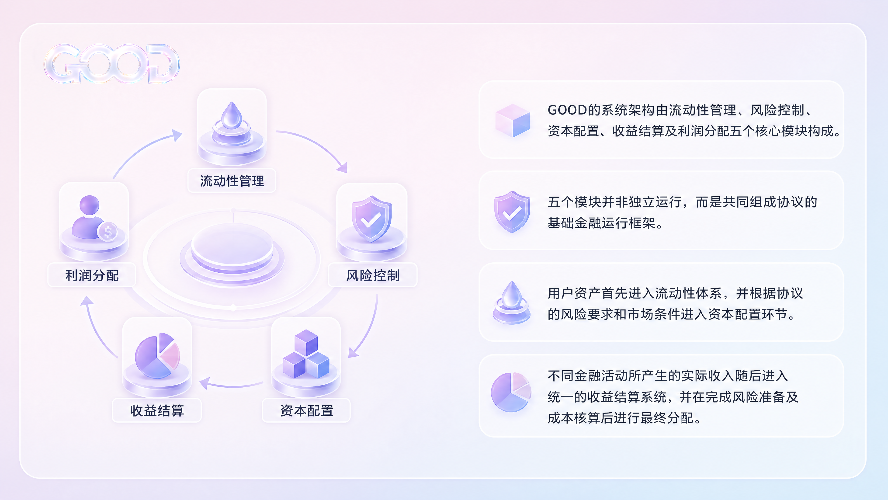

# Protocol Architecture

Good Tomorrow is a liquidity-based onchain financial infrastructure protocol. Its operating flow consists of asset deposits, liquidity management, capital allocation, financial activities, yield settlement, and profit distribution.

## Operating Flow

| Stage | Function |
| --- | --- |
| Asset deposit | Eligible user assets enter the protocol. |
| Liquidity management | The system maintains reserves for redemption, settlement, and normal operations. |
| Capital allocation | Available capital is routed by market demand, utilization, risk parameters, and strategy capacity. |
| Financial activities | Capital may support trading, stablecoin liquidity, payments, yield strategies, and qualified future RWA activities. |
| Yield settlement | Realized income is recognized and aggregated. |
| Profit distribution | Distributable profit is allocated after losses, reserves, and costs. |

## Five Core Modules

Good Tomorrow's architecture consists of five mutually dependent modules:

| Module | Role |
| --- | --- |
| Liquidity layer | Handles deposits, redemptions, liquidity reserves, and basic capital scheduling. |
| Risk layer | Continuously evaluates protocol assets and external financial activities. |
| Capital allocation layer | Allocates available capital to markets and financial scenarios under protocol rules. |
| Yield settlement layer | Accounts for realized income from different financial activities. |
| Profit distribution layer | Processes and distributes net profit after risk and cost deductions. |

These modules form a shared financial operating framework. User assets first enter the liquidity system, then move into capital allocation only when protocol risk requirements and market conditions permit. Income from different activities is collected into a unified settlement system before final distribution.

Good Tomorrow is not designed to concentrate all capital into a single high-yield strategy. It creates a multilayer capital allocation system where funds with different liquidity needs, risk levels, and use periods can be routed to different financial activities while maintaining a balance among asset safety, liquidity, and capital efficiency.
