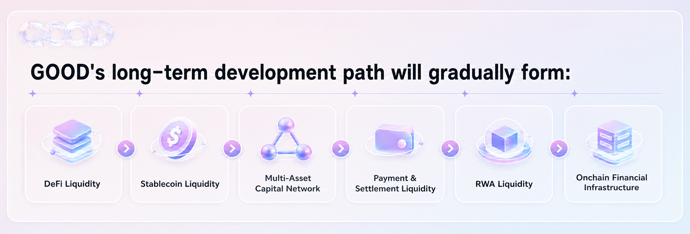

# Development Roadmap

Good Tomorrow's development is centered on onchain liquidity. It begins with DeFi capital management and gradually expands into stablecoins, onchain finance, payments and settlement, and RWA liquidity infrastructure.

The long-term path is:

**DeFi Liquidity -> Stablecoin Liquidity -> Multi-Asset Capital Network -> Payment and Settlement Liquidity -> RWA Liquidity -> Onchain Financial Infrastructure**

## Phase 1: Liquidity Base Layer

- Establish the base financial protocol architecture.
- Complete asset deposit and redemption mechanisms.
- Build a unified liquidity management system.
- Create foundational risk parameters and asset management framework.
- Deploy the Good Tomorrow/USDC initial liquidity market.
- Complete core smart contract testing and security audits.

Goal: establish the first liquidity infrastructure layer so user assets can enter a unified, transparent, and verifiable onchain capital management system.

## Phase 2: DeFi Capital Network

- Move from single liquidity management into onchain capital allocation.
- Connect mainstream DeFi financial markets.
- Build lending, liquidity, and yield-oriented capital allocation capability.
- Establish dynamic capital utilization models.
- Introduce strategy capacity management and risk budgets.
- Enable capital scheduling across markets.

Target cycle: **Liquidity -> Lending -> Yield -> Redistribution**.

## Phase 3: Stablecoin Liquidity Network

- Expand support for multiple stablecoin assets.
- Establish stablecoin admission and risk-rating mechanisms.
- Connect major USD stablecoin markets.
- Explore regional and regulated stablecoin liquidity demand.
- Build capital scheduling and liquidity support among stablecoins.

Supported directions may include USD stablecoins, regional stablecoins, HKD stablecoins, payment stablecoins, and regulated stablecoins.

## Phase 4: Payment and Settlement Liquidity Infrastructure

- Enter stablecoin payment and onchain settlement markets.
- Build instant liquidity management for payment scenarios.
- Support merchant settlement and capital scheduling.
- Explore cross-border payment and multi-stablecoin settlement.
- Connect payment networks with DeFi liquidity.

Target cycle: **Payment -> Settlement -> Liquidity -> Yield**.

## Phase 5: RWA Liquidity Infrastructure

- Gradually connect RWAs that meet protocol risk standards.
- Build RWA admission, risk assessment, and liquidity management frameworks.
- Explore onchain liquidity needs for treasuries, bonds, funds, notes, and other real-world yield assets.
- Connect stablecoins with real-world assets.
- Support portfolio allocation across different maturities and risk levels.

Target cycle: **Stablecoin Liquidity <-> Onchain Capital <-> Real World Assets**.

## Phase 6: Multi-Ecosystem Liquidity Network

As stablecoins, payment networks, DeFi protocols, and RWA assets connect, Good Tomorrow will develop a unified liquidity network. Financial applications can share liquidity management, capital allocation, stablecoin support, payment and settlement liquidity, RWA access, risk infrastructure, and yield settlement.

## Phase 7: Onchain Financial Infrastructure

Good Tomorrow ultimately aims to establish liquidity finance infrastructure that covers onchain and real-world financial needs. Stablecoins become the value medium, DeFi provides open markets, Good Tomorrow provides unified liquidity and capital management, payment networks provide commercial use cases, and RWA brings real-world assets onchain.
