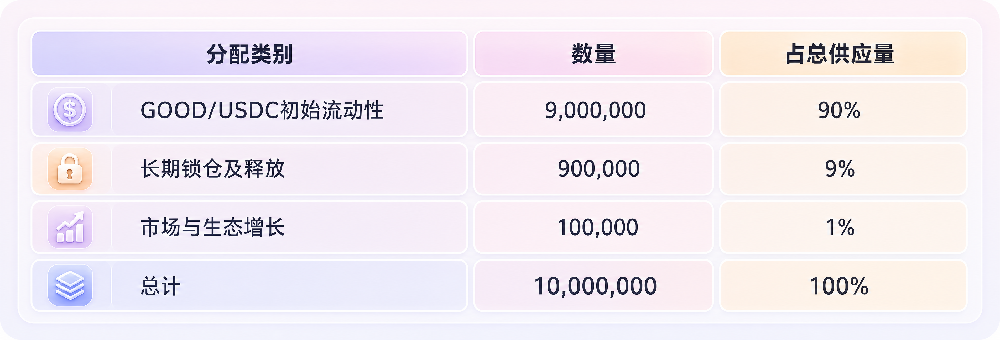

# 토큰과 거버넌스

Good Tomorrow는 Good Tomorrow 프로토콜의 네이티브 생태계 토큰이며 BNB Smart Chain 배포를 계획합니다. 총 공급량은 **10,000,000 Good Tomorrow**로 고정됩니다.

| 배분 항목 | 수량 | 총 공급량 비중 |
| --- | ---: | ---: |
| Good Tomorrow/USDC 초기 유동성 | 9,000,000 | 90% |
| 장기 락업 및 릴리스 | 900,000 | 9% |
| 시장 및 생태계 성장 | 100,000 | 1% |
| 합계 | 10,000,000 | 100% |

장기 락업 물량 9%는 출시 후 첫 12개월 동안 완전히 잠기고, 이후 12개월 동안 선형으로 릴리스됩니다. 균등 월별 릴리스 기준 이론적 월 릴리스 물량은 다음과 같습니다.

$$
\frac{900,000}{12}=75,000
$$

거버넌스는 탈중앙화 의사결정과 전문 리스크 관리 사이의 경계를 설정해야 합니다. 일반 생태계 발전 사항은 점진적으로 커뮤니티 거버넌스로 이전될 수 있지만, 자본 배분 비율, 자산 리스크 파라미터, 중대한 금융 리스크 사건은 거버넌스 공격과 시장 조작을 막기 위한 강한 보호가 필요합니다.
