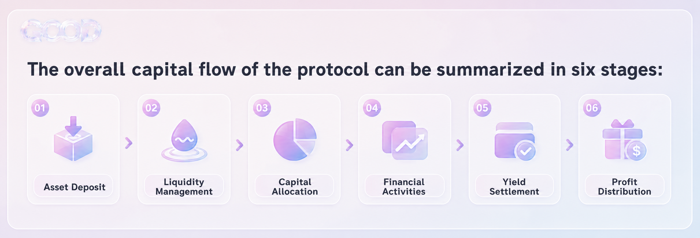
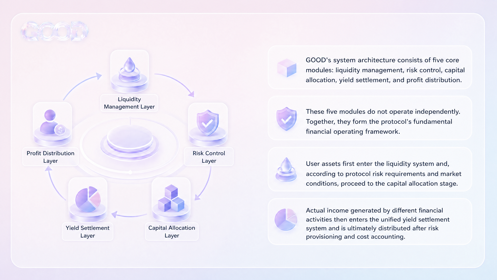

# 프로토콜 아키텍처

Good Tomorrow는 유동성을 기반으로 하는 온체인 금융 인프라입니다. 운영 흐름은 자산 예치, 유동성 관리, 자본 배분, 금융 활동, 수익 정산, 이익 분배로 구성됩니다.

| 단계 | 기능 |
| --- | --- |
| 자산 예치 | 적격 사용자 자산이 프로토콜에 들어옵니다. |
| 유동성 관리 | 상환, 결제, 정상 운영에 필요한 준비금을 유지합니다. |
| 자본 배분 | 시장 수요, 활용률, 리스크 파라미터, 전략 수용 능력에 따라 자본을 배치합니다. |
| 금융 활동 | 거래, 스테이블코인 유동성, 결제, 수익 전략, 적격 RWA를 지원합니다. |
| 수익 정산 | 실현 수입을 확인하고 집계합니다. |
| 이익 분배 | 손실, 준비금, 비용 차감 후 배분합니다. |

Good Tomorrow의 핵심 모듈은 유동성 계층, 리스크 계층, 자본 배분 계층, 수익 정산 계층, 이익 분배 계층입니다. 이 모듈들은 독립적으로 움직이지 않고 하나의 금융 운영 프레임워크를 이룹니다.

프로토콜의 목적은 모든 자본을 단일 고수익 전략에 집중하는 것이 아닙니다. 서로 다른 유동성 요구, 리스크 수준, 사용 기간을 가진 자금을 여러 금융 활동에 배치하면서 안전성, 유동성, 자본 효율의 균형을 유지하는 것입니다.
