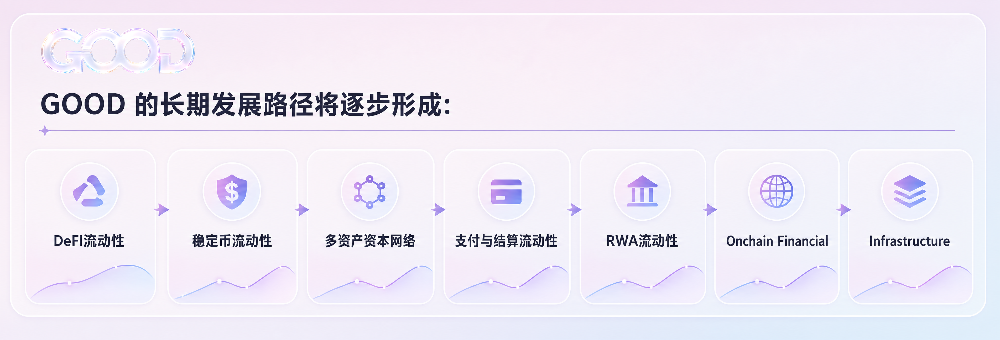

# 发展路线图

Good Tomorrow 的发展将以链上流动性为核心基础，从 DeFi 资本管理体系出发，逐步构建覆盖稳定币、链上金融、支付结算及 RWA 的流动性金融基础设施。

长期发展路径为：

**DeFi 流动性 -> 稳定币流动性 -> 多资产资本网络 -> 支付与结算流动性 -> RWA 流动性 -> Onchain Financial Infrastructure**

## 第一阶段：流动性基础层

建立基础金融协议架构；完成资产存入与赎回机制；建立统一流动性管理体系；构建基础风险参数与资产管理框架；部署 Good Tomorrow/USDC 初始流动性市场；完成核心智能合约测试与安全审计。

目标：建立第一层流动性基础设施，使用户资产能够进入统一、透明且可验证的链上资本管理体系。

## 第二阶段：DeFi 资本网络

从单一流动性管理进入链上资本配置，接入主流 DeFi 金融市场，构建借贷、流动性和收益型资本配置能力，建立动态资金利用率模型，引入策略容量管理与风险预算机制，并实现多市场资本调度。

基础循环为：**流动性 -> 借贷 -> 收益 -> 再分配**。

## 第三阶段：稳定币流动性网络

扩展多稳定币资产支持，建立稳定币资产接入与风险评级机制，连接主流美元稳定币市场，探索区域性稳定币与合规稳定币流动性需求，并构建稳定币之间的资本调度与流动性支持能力。

未来方向包括 USD Stablecoins、Regional Stablecoins、HKD Stablecoins、Payment Stablecoins 和 Regulated Stablecoins。

## 第四阶段：支付与结算流动性基础设施

进入稳定币支付与链上结算市场，构建支付场景下的即时流动性管理能力，支持商户结算与资金调度，探索跨境支付与多稳定币结算机制，并连接支付网络与 DeFi 流动性。

链上资金循环为：**Payment -> Settlement -> Liquidity -> Yield**。

## 第五阶段：RWA 流动性基础设施

逐步接入符合协议风险标准的 RWA，建立 RWA 接入、风险评估和流动性管理框架，探索国债、债券、基金、票据及其他现实世界收益资产的链上流动性需求，建立稳定币与现实世界资产之间的资本连接，并支持不同期限和风险等级资产组合配置。

资本循环为：**Stablecoin Liquidity <-> Onchain Capital <-> Real World Assets**。

## 第六阶段：多生态流动性网络

随着稳定币、支付网络、DeFi 协议和 RWA 资产逐步接入，Good Tomorrow 将发展统一流动性网络，使不同金融应用共享流动性管理、资本配置、稳定币支持、支付与结算流动性、RWA 接入、风险管理和收益结算能力。

## 第七阶段：Onchain Financial Infrastructure

最终，Good Tomorrow 希望建立覆盖链上与现实世界金融需求的流动性金融基础设施。稳定币成为价值流通媒介，DeFi 提供开放金融市场，Good Tomorrow 提供统一流动性与资本管理能力，支付网络提供现实商业场景，RWA 将现实世界资产带入链上。
